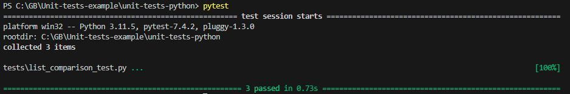
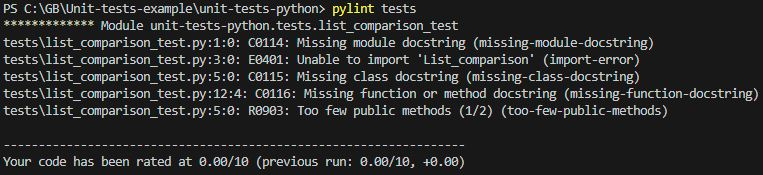

Был написан класс для сравнения 2 списков и метот в этом классе, принимающий 2 списка и возвращающий один из 3 вариантамов сравнения в виде текста.\
Так же был написан тест к этому классу, который покрывает все 3 варианта сразу, используя *@pytest.mark.parametrize* с передачей в него 3 комбинации 3 параметров (2 списка и результат).

Результат команд *pytest* и *pylint*:

Тест *import* видит, но *pylint* нет.